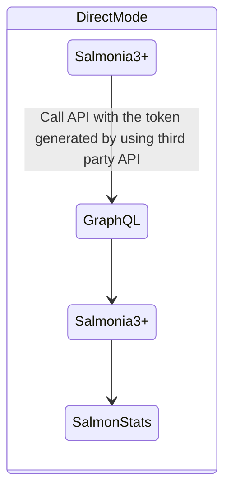
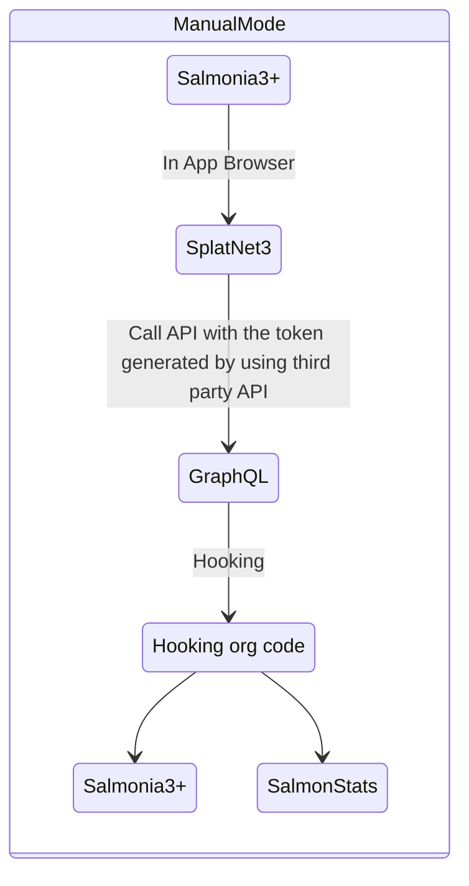
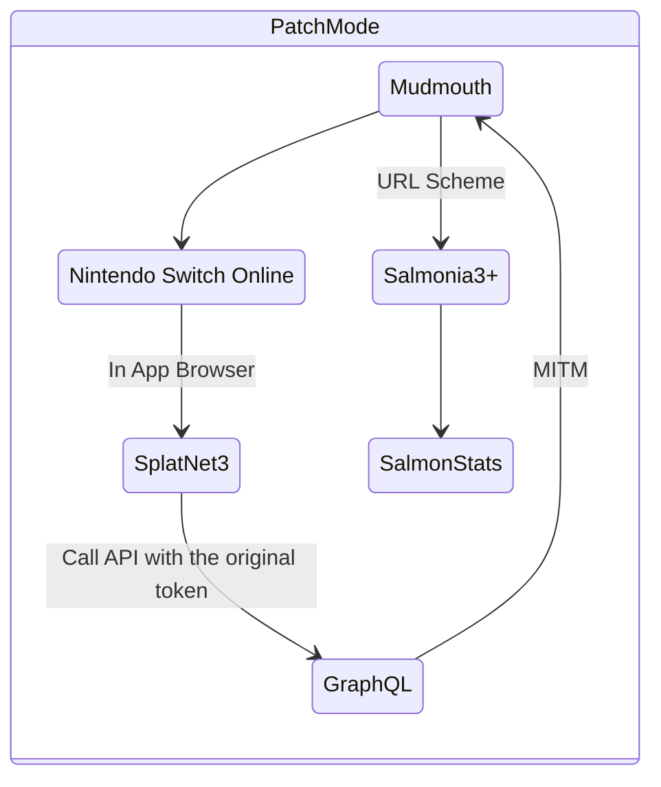
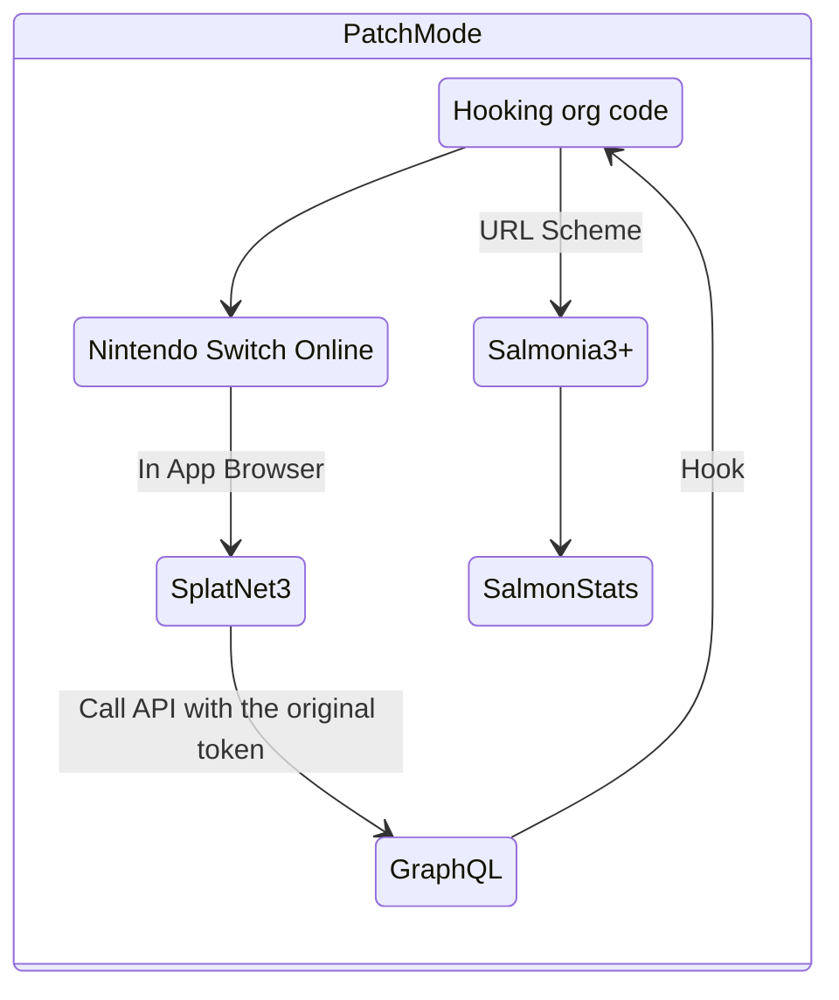

## 背景

非公式アプリ利用者をBANするという措置を取ってきたため、Salmonia3+にも対応が求められました。

以下、考えられうる対策とその対策を実現するためのモードの紹介です。

## 各モードについて

それぞれのモードについては、

- 非公式APIを使うかどうか
- リクエスト形式が独自のものかどうか
- 公式アプリを利用するかどうか

の違いしかありません。

| 各種モード  | 非公式API | リクエスト形式 | 導入           | 公式アプリ | 有効期限         | 
| :---------: | :-------: | :------------: | :------------: | :--------: | :--------------: | 
| Direct Mode | 利用      | 独自           | 楽             | -          | 無期限/90日      | 
| Manual Mode | 利用      | 公式           | 楽             | -          | 無期限/90日      | 
| VPN Mode    | -         | 公式           | 別アプリが必要 | 利用       | 無期限           | 
| Patch Mode  | -         | 公式           | 知識が必要     | 利用       | 無期限/7日/365日 | 

### Direct Mode

現在のSalmonia3+で使われているモードです。APIを直接叩くので余計な処理が発生せず、最速です。

これが原因かははっきりしませんが、Salmonia3+ユーザーでイカリング3をBANされたという人もいます。

BANされた理由として考えられるのは「非公式APIを利用して作成されたトークンを使っていること」、「一気にリザルトを取得しようとして負荷をかけた」、「リクエストの取得方法で検知された」、「QRコード取得APIを叩いた」などが考えられます。

このうち、一気にリザルトを取得しようとしてしまう件については修正予定で、QRコード取得APIを叩いてしまう件については対応済みです。

残りの二つが原因なのであれば、もっと多くの人がBANされていてもおかしくないのでこれがBANの最有力候補だと考えています。

### Manual Mode

同じく非公式APIを利用した作成されたトークンを使います。

アプリ内ブラウザ(イカリング3ビューワ)を利用してリザルトをアップロードします。Direct Modeよりは低速です。

### VPN Mode

別の連携アプリを利用して公式のトークンを用いてリザルトを取得します。

公式アプリが取得したデータをSalmonia3+に渡す方式ですので、理論上公式アプリと全く同じ動作をするため有効なBAN対策となり得ます。

ただし、別の連携アプリが必要になるのでそこだけが手間で、導入もそれなりにめんどくさいです。リザルト取得も若干手間なのでどのくらい利用する人がいるかは微妙なところです。

### Patch Mode

公式のアプリにパッチをあてて、公式アプリ自体でリザルトを取得するモードです。

> Manual ModeのNintendo Switch Online版のような感じです

VPNモードと同じく有効なBAN対策となり得ます。

このモードのみ、Salmonia3+のインストールを必要としません。つまり、Salmonia3+でリザルトが確認できないので、Salmon Statsで自分のリザルトを確認する何らかの仕組みを導入するアップデートが必要になります。

また、アプリにパッチを当てるためにはパッチがあたったアプリをインストールするか、端末自体にパッチをインストールする必要があります。正直どちらのハードルも高く、Salmonia3+でリザルトを確認できないというデメリットががあります。このモードのメリットは「完全に公式と同じ」「外部連携アプリ不要」という点だけですので、デメリットを上回るメリットがあるかというと微妙です。

## 最後に

もし、開発者である私自身がどのモードを使いますかと訊かれたら、間違いなくダイレクトモードと答えます。

記事は以上。