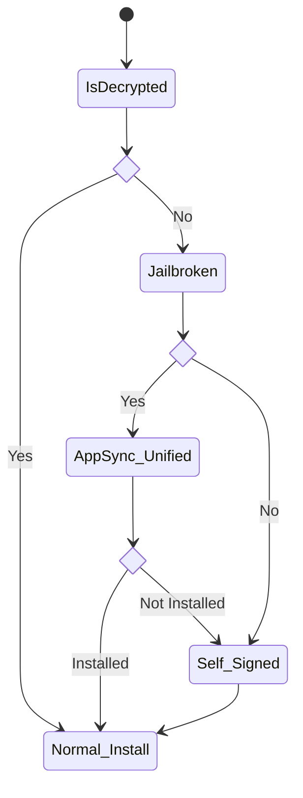

## Sideloadly

SideloadlyはApp Storeを経由せずにデバイスにアプリケーションをインストールするSideloadを可能にするツールのこと。

ツール自体は[公式サイト](https://sideloadly.io/)で手に入れることができる。

WindowsとmacOSの両方対応なので嬉しい。

### Sideloadの仕組み

まず、大前提としてデバイスにインストールされるアプリは正しく「署名」がされていなければいけない。

署名されていないアプリはデバイスが脱獄されていてAppSync Unifiedがインストールされていない限り、インストールできない。AppSync Unifiedはアプリをインストールする際に署名をチェックする機能を無効化するものである。

わざわざ何のために署名がされていないアプリをインストールする必要があるのかというと、殆どの場合海賊版アプリを起動させるためである。

もちろん、海賊版アプリにも誰かが署名をしてAppSync Unifiedを利用せずともインストールできるように配布することはできるが、署名をすれば誰が海賊行為に関わっているかバラすようなものなので海賊版は基本的に署名がされていない。

ウェブ上でインストールするような仕組みの海賊版は以前は署名がされていたが、すぐにAppleにBANされるので現在の海賊版はAltStoreなどを利用するように誘導するものがほとんどである。

ちなみにAltStoreはSideloadlyと同じく、自分自身でアプリに署名をさせるツールである。

### フローチャート

つまり、結局最終的には全てNormal Installが実行されるのだが「署名がされていなければ自分自身で署名をする」というのがSideloadの骨子となっている。じゃあ何のために自己署名ができるようになっているのかというと、Xcodeなどで開発を行うときに実機で検証する必要があるからだ。

このとき、自己署名がもしできなければいちいちアプリをAppleに署名してもらわねばならず、非常に面倒なことになっていただろう。

ちなみに自己署名はApple Developer Programに加入しているかどうかによって有効期限が異なり、加入していれば365日、加入していなければ7日となっている。以前は加入していなくても90日使えたのだがあまりに自己署名を悪用する人が多かったため期限を短くされてしまった。

更に、未加入の場合は同時に署名できるアプリも三つまでに制限されている。

とはいえ、Apple Developer Programは年間15000円ほどするのでSideloadのためだけに加入する必要性は薄いかもしれない。

| 署名方法       | 処理              | Bundle ID  | 有効期限         | 
| :------------: | :---------------: | :--------: | :--------------: | 
| Sideload       | 署名+インストール | 変わる     | 7日/365日        | 
| Normal Install | インストール      | 変わらない | 元々の期限に依存 | 
| Ad-hoc sign    | 署名+インストール | 変わる     | 365日            | 
| Export IPA     | 署名              | 変わる     | -                | 

### Sideloadの制限

Sideloadは自己署名をする以上、Bundle IDが変わってしまうという問題点がある。

これがどのように影響を与えるかというと、具体的にはBundle IDに依存する仕組みが動作しなくなり一部のアプリでのログインや通知がとんでこなくなる。基本的に通知は全て飛んでこないと思ったほうが良い。

> Twitterでは通知がとんでこない、Nintendo Switch Onlineではログインできないを確認している

もしもこれらの制限を回避したいのであれば正規の署名がされたアプリをインストールするか、AppSync Unifiedを使うしかない。

## まとめ

さて、そもそもなぜSideloadlyを使いたいかということなのだが、例えばあるアプリの広告を非表示にする脱獄向けデバイスのTweakがあったとしよう。

当然、これは脱獄されているデバイスでしかインストールできない。

脱獄されているデバイスでこれをインストールした場合、正規の署名のアプリなので通知はちゃんと来るし、Tweakも効く。

で、このTweakをそもそもIPAに組み込んでしまって未脱獄でも脱獄アプリのようにTweakを効かせようというのが元々のSideloadの発端である。

IPAに組み込むTweakは非脱獄であるゆえにSandboxの壁を超えられないとか、Mobile Substrateと依存関係があってはいけないとか、rootの権限がないなどの制約はあるが広告を非表示にするくらいなら簡単にできる。

ところがこのIPAにTweakを組み込む段階でTweakを読み込むようにバイナリにパッチを当てる必要がある。パッチを当ててしまうと元々の署名は意味をなさなくなり、Normal Installができない。

そこで自己署名をしてSideloadしましょう、となったわけである。

Tweakが入れられないデバイス向けにSideloadが考えられたのだから、脱獄しているデバイスでSideloadをする意味は全くない。同じアプリをクローンしたいときくらいである。

記事は以上。
