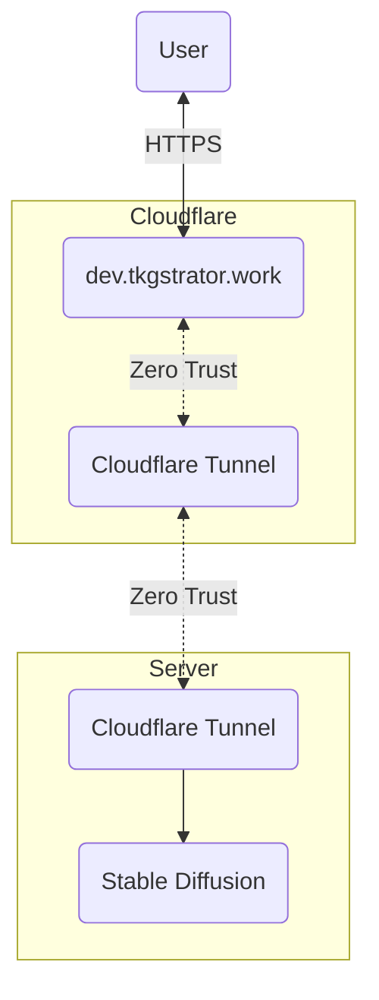
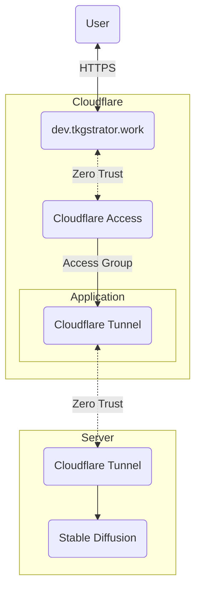

## 概要

例えばうちは[dev.tkgstrator.work](https://dev.tkgstrator.work/)にアクセスするとCloudflaredを経由して誰でもStable Diffusionが利用できるようになっている。



このときの流れは上のようになっている。Serverにアクセスするまでの過程はCloudflareのZero TrustとHTTPSで安全であることは保障されるが、アクセスしてきて人間が悪意のある人間かどうかはチェックされていない。要するに、誰でもサービスを利用できてしまうのである。　

ところが、一応Stable Diffusionは計算リソースを使う上に使い続ければ電気代もかかるし、一般的に不適切とされる絵を生成されても困るので「アクセスできるのは一部の人にする」という仕組みが欲しい。

### Cloudflare Access

完全に理解しているわけではないので推測になってしまうのだが、Cloudflare Accessはセッションが有効なユーザーのみのアクセスを許可する仕組みを提供する。つまり、最初に一回認証をすればセッションが切れるまでは再認証せずにアクセスができるようになる。

ではどのようにユーザーを認証するのかということになるのだが、それを提供するのがZero TrustのAccess Groupという仕組みだ。

このAccess Groupは豊富な認証方式を提供しており、一例を挙げると、

- Emails
- Emails ending in
- External Evaluation
- Authentication Method
- Access groups
- IP ranges
- Country
- Everyone
- Common name
- Valid Certificate
- Service Token
- Any Access Service token
- Login Methods
- OIDC Claims

があり、例えばAuthentication MethodであればSMS認証やパスワード認証などいろいろ選ぶことができる。この機能がなんと無料で使えてしまう、本当に大丈夫なのか。

で、例えばメールアドレス認証をするなら「特定のメールアドレスであれば認証する」というルールをAccess Groupとして設定し、設定したAccess GroupだけがCloudflare Tunnelが展開しているURLと連携しているApplicationにアクセスする権限を持つというように設定すれば良い。



Cloudflare Accessは指定したドメインに対する認証システムを提供する。今回の場合で言えばdev.tkgstrator.workに対する認証をつけるとしよう。

## 手順

Access GroupsとApplicationsの二つのパートに分けて解説する。

### Access Groups

[Cloudflare](https://one.dash.cloudflare.com/)にアクセスして、`Access -> Applications`から設定を確認する。

今回はStable Diffusionに対するアクセスを制限したいのでGroup nameは`Stable Diffusion`とした。

認証方法はメールアドレスとし、登録されているメールアドレスであればログインができるようにする。

あとは設定を保存して終了である。

### Applications

[Cloudflare](https://one.dash.cloudflare.com/)にアクセスして、`Networks -> Tunnels`から設定を確認する。

`Routes: dev.tkgstrator.work`に対してTunnelが貼られており、ステータスが`HEALTHY`になっていればサービス自体はちゃんと動いている。

次に、`Access -> Applications`からサブドメイン`dev.tkgstrator.work`を認証するためのアプリケーションを作成する。このサブドメインで動いているのはStable Diffusionなので`Stable Diffusion`という名前でアプリケーションを作成した。

Tunnelでサービスを動かしている場合は`Type: SELF-HOSTED`を指定する。

セッションの有効期限である`Session Duration`は好きな値を入れれば良いが、長すぎるとセッションハイジャックをされたときにめんどくさいので個人的には`No duration, expires immediately`を設定している。

とはいえ、これをやるとアクセスするたびに認証が要求されるのだが......

`Application domain`にはCloudflare Tunnelで動作中のサービスのドメインを指定する。今回の場合はdev.tkgstrator.workである。

次にこのApplicationにアクセスする権限を持つPolicyを設定する。いろいろ言葉が出てきて難しいが、Policyとは要するにAccess Groupsを拡張したものである。

Access GroupsとPolicyが何故別れているかというと、例えばAとBの二つのAccess Groupがあったとして一方には管理者権限をつけたいが、もう一方はただ閲覧できるだけというような設定をしたい場合があるからだ。

この場合、AはAllow, BはBlockと設定したPolicyをApplicationと紐つければ良い。つくづく便利な仕組みである。

## SAML認証

とはいえ、ここまで読んで「あれ、これめんどくさくない？」と思った方も多いと思う。

何故なら、例えばアクセスできるユーザーを一人増やそうと思ったら、

1. メールアドレスを訊く
2. 返事が返ってくる
3. Access Groupにその人のメールアドレスを登録する

という三つのステップが要求されるためだ。人が増えてくれば管理するのもめんどくさくなってくる。

そこで利用したいのがSSO(シングルサインオン)である。

### 必要なもの

- Cloudflareのアカウント
- Discordのアカウント

Cloudflareのアカウントがあるのは当たり前なのだが、ここではDiscordのアカウントも用意する。

### Cloudflare

[Cloudflare](https://one.dash.cloudflare.com/)にアクセスして、`Settings -> Custom Pages`から`Team domain`の値を確認する。

今回の場合は`tkgstrator.cloudflareaccess.com`だったのでこれをメモしておく。この値を`TEAM_DOMAIN`とすることにしよう。

#### KV

[Worker & Pages](https://dash.cloudflare.com/2488ea57494b2dacae95a6e363e7dcb2/workers/kv/namespaces)から適当なKVを作成する。

今回はDiscordの認証なので`Discord`という名前にしたが、名前自体は何でも良い。

作成したらNamespace IDをコピーする。この値を`NAMESPACE_ID`とすることにしよう。

### Discord Developer Portal

[Discord Developer Portal](https://discord.com/developers/applications)から新規アプリケーションを作成する。

#### OAuth2

作成したら`OAuth2`を開いて`CLIENT ID`と`CLIENT SECRET`の値をコピーする。

更にRedirectsのところに`https://${TEAM_DOMAIN}/cdn-cgi/access/callback`と入力する。`TEAM_DOMAIN`のところにはさっきメモした値を入力する。

> 自分の場合は`https://tkgstrator.cloudflareaccess.com/cdn-cgi/access/callback`となった

これができたら`URL Generator`からSCOPESのbotにだけチェックを入れて作成された`GENERATED URL`の値をコピーする。この値を`GENERATED_URL`としよう。

このURLを開けば自分が管理するサーバーに対して作成したアプリケーションを招待することができる。

#### Bot

次に`Bot -> TOKEN`を発行してメモする。この値を`DISCORD_TOKEN`とすることにしよう。

自分用の認証なので`Authorization Flow -> PUBLIC BOT`は外しておくと良い。

ここまでできればDiscord Developer Portalでの作業は完了である。

## discord-oidc-worker

さて、ここまでいくつかの値をコピーしてきたが、洩れがないか確認しよう。

| キー          | サービス                         | 利用場所                            | 
| ------------- | -------------------------------- | ----------------------------------- | 
| TEAM_DOMAIN   | Cloudflare(Dashboard)            | Discord Developer PortalのRedirects | 
| NAMESPACE_ID  | Cloudflare(Worker & Pages)       | discord-oidc-worker                 | 
| CLIENT_ID     | Discord Developer Portal(OAuth2) | discord-oidc-worker                 | 
| CLIENT_SECRET | Discord Developer Portal(OAuth2) | discord-oidc-worker                 | 
| GENERATED_URL | Discord Developer Portal(OAuth2) | discord-oidc-worker                 | 
| DISCORD_TOKEN | Discord Developer Portal(Bot)    | discord-oidc-worker                 | 

取得したほとんどすべての値はこれからの作業に必要になる。入力ミスをすると当然動かないので注意しよう。

```zsh
git clone https://github.com/tkgstrator/discord-oidc-worker
cd discord-oidc-worker
yarn install
```

### wrangler.toml

最初に`wrangler.toml`を編集する。

```
name = "discord-oidc"
main = "worker.js"
compatibility_date = "2022-12-24"

kv_namespaces = [
  { binding = "KV", id = "${NAMESPACE_ID}", preview_id = "b43c22430b5240dea89cd6cc350d3946" }
]
```

IDのところに`NAMESPACE_ID`を入力する。

元々のドキュメントのところに`preview_id`に関する記述はなかったので多分こっちは何でも良い。触らずにいておくとよいだろう。

> 存在しないidを指定するとこの後で`deploy`したときにNo KV namespace found with ID 0b9abda82acf461c8d4ecda656217e20 [code: 10041]というエラーが発生する

### config.json

config.jsonは機密情報を含むので`config.sample.json`からコピーする。

```zsh
cp config.sample.json config.json
```

BOTを呼んだサーバーのアイコンの上で右クリックでサーバーID(`SERVER_ID`)をコピーする。こうすることでユーザーが認証を行ったときにそのユーザーがそのサーバーで持つ役職IDを取得することができる。

```json
{
    "clientId": "${CLIENT_ID}",
    "clientSecret": "${CLIENT_SECRET}",
    "redirectURL": "https://${TEAM_DOMAIN}.cloudflareaccess.com/cdn-cgi/access/callback",
    "serversToCheckRolesFor": [
        "${SERVER_ID}"
    ]
}
```

## wrangler

### ログイン

`yarn wrangler login`でブラウザ経由でCloudflareにログインできる。

まだログインしていない場合はログインしておこう。

### デプロイ

`yarn wrangler secret put DISCORD_TOKEN`を実行するとシークレットとしてDISCORD_TOKENというキー名を持つ値をCloudflareに保存することができる。

> このコマンドはそのままこれを入力すること、`DISCORD_TOKEN`はなにかの文字に置き換えるわけではない

```zsh
yarn wrangler secret put DISCORD_TOKEN
-------------------------------------------------------
? Enter a secret value: › 
```

シークレット値を入力しろと出るので、ここで先程コピーしておいた`DISCORD_TOKEN`を入力してエンターキーを押す。

特に何も起こらないが、これで設定が保存される。

```zsh
yarn deploy
```

最後に`yarn deploy`をする。

すると以下のような出力が得られる。

```zsh
Your worker has access to the following bindings:
- KV Namespaces:
  - KV: 1ec96d0feddd41d79444c95438595960
Total Upload: 72.40 KiB / gzip: 17.05 KiB
Uploaded discord-oidc (1.49 sec)
Published discord-oidc (0.35 sec)
  https://discord-oidc.lemonandchan.workers.dev
Current Deployment ID: d5b5d389-3601-44fd-a36e-fb9a8aa5bee8
✨  Done in 3.58s.
```

ここの`https://discord-oidc.lemonandchan.workers.dev`のように表示されている値を`WORKER_URL`としてコピーしておこう。

## Cloudflare

ここまでできたら再びCloudflareのサイトに戻る。

[Cloudflare](https://one.dash.cloudflare.com/)から`Settings -> Authentication -> Login methods -> Add new -> OpenID Connect`を選択する。

| キー                        | 値                             | 
| --------------------------- | ------------------------------ | 
| Name                        | 任意                           | 
| App ID                      | CLIENT_ID                      | 
| Client secret               | CLIENT_SECRET                  | 
| Auth URL                    | ${WORKER_URL}/authorize/guilds | 
| Token URL                   | ${WORKER_URL}/token            | 
| Certificate URL             | ${WORKER_URL}/jwks.json        | 
| Proof Key for Code Exchange | 有効                           | 

このままの設定でもいいのだが、こうするとDiscordで認証できる(アカウントを持っている全員)がサービスを使えてしまうので、何らかのチェックを行えるようにする。

> Auth URLは末尾は`guilds`に変えて`email`もできるが`guilds`の方が多分使い勝手が良い

なのでその下のOIDC Claimsから別のフィールドを返すように設定する。

| キー名             | 意味                                   | 
| ------------------ | -------------------------------------- | 
| id                 | ユーザーID                             | 
| username           | ユーザー名                             | 
| guilds             | 所属しているサーバーID                 | 
| discriminator      | ディスコードのタグ                     | 
| roles:${SERVER_ID} | そのサーバーで割り当てられている役職ID | 

その他にも`preferred_username`や`name`や`global_name`などが設定できるようだが`name`に関してはユニークな値でないため認証として利用するのは避けたほうが良いとのこと。

使えるキー名については[ユーザー構造体](https://discord.com/developers/docs/resources/user#user-object-user-structure)を読むと良い。

ここまで設定ができれば保存してテストを実行してみよう。ミスがなければDiscordの認証画面が開いて、認証後にユーザーの情報が取得できるはずだ。

```json
{
  "email": "lemonandchan@gmail.com",
  "oidc_fields": {
    "id": "430364540899819520",
    "username": "devonly",
    "discriminator": "0",
    "roles:1109467734779117741": [
      "1110574058732523520"
    ]
  }
}
```

### Access Groups

次にDiscord認証に対応したAccess Groupを作成する。

設定するのは`Define group criteria`で`Selector`には`Login Methods`を指定して`OpenID Connect・Discord`を指定する。

これでここまで苦労して作ってきたシングルサインオンとAccess Groupを紐つける。

### Applications

はい、これでようやく最後です。

作成したApplicationsにDiscordのPolicyでAssign a groupでDiscordを設定します。

Create additional rulesでOIDC Claimsのフィールドの値をつければ良いです。

例えば、あるサーバーである役職を持っている人だけを許可するのであれば、

| selector    | Claim name                | Claim value         | 
| ----------- | ------------------------- | ------------------- | 
| OIDC Claims | roles:1109467734779117741 | 1110574058732523520 | 

と設定すれば良いです。

記事は以上。