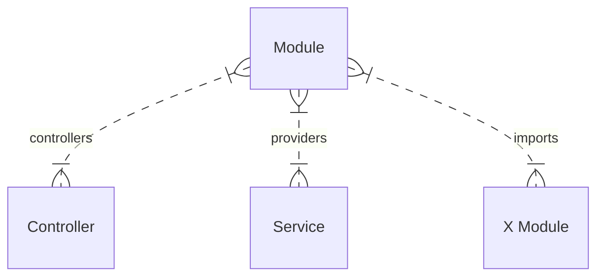

## NestJS

NestJSにはよく使う三つの要素としてModule, Service, Controllerがあります。



そしてX ModuleはY Moduleのような別のモジュールを読み込んでいたりします。

### Module

`@Module`とついていればModuleになる。

```ts
@Module({
  controllers: [AppController], // Module -> Controllerを張る
  imports: [], // Module <- Moduleを張る
  providers: [AppService], // Module -> Serviceを張る
})
export class AppModule {}
```

`imports`には別で提供されているModuleを利用したい場合にここに登録しておくとよい。以下、よく使っているモジュールを紹介しておきます。

- [`PrometheusModule`](https://github.com/willsoto/nestjs-prometheus)
  - アクセスのデータとか集められるModule
- [`PrismaModule`](https://github.com/notiz-dev/nestjs-prisma)
  - Prismaが利用できるModule
- [`ThrottlerModule`](https://github.com/nestjs/throttler)
  - アクセス制限をかけられるModule
- [`ConfigModule`](https://github.com/nestjs/config)
  - .envを読み込めるやつModule
- [`CacheModule`](https://github.com/nestjs/cache-manager)
  - キャッシュを利用できるModule
- [`HttpModule`](https://github.com/nestjs/axios)
  - axiosを利用できるModule
- [`ScheduleModule`](https://github.com/nestjs/schedule)
  - 定期実行が設定できるModule
- [`GraphQLModule`](https://github.com/nestjs/graphql)
  - GraphQLを利用できるModule

で、これらは各Moduleに設定すべきかAppModuleに設定すべきかという問題があるのですが、まあ個人的にはよくわからんのでAppModuleに突っ込もうと思います。

いっぱい入れると立ち上げるのが重くなるのですが[LazyModuleLoad](https://docs.nestjs.com/fundamentals/lazy-loading-modules)を利用すれば良いとのこと、多分。

で、Moduleをimportsに突っ込むときに`isGlobal`というオプションを設定できるので、それを設定するとAppModuleに繋がっているController全てで利用できるようになります、多分。

### Controller

`@Controller()`とついていればControllerになる。

ControllerからはServiceが主に以下のようなコードで利用できる。

```ts
@Controller()
export class AppController {
  constructor(private readonly service: AppService) {}

  async index(): Promise<string> {
    return this.service.index() // Serviceのコードが呼べる
  }
}
```

### Service

`@Injectable()`とついていればServiceになる。

> そこは`@Service()`じゃないのか......

```ts
@Injectable()
export class AppService {
  // Controllerから呼ぶコードを実装する
  async index(): Promise<string> {
    return 'Hello, World!'
  }
}
```