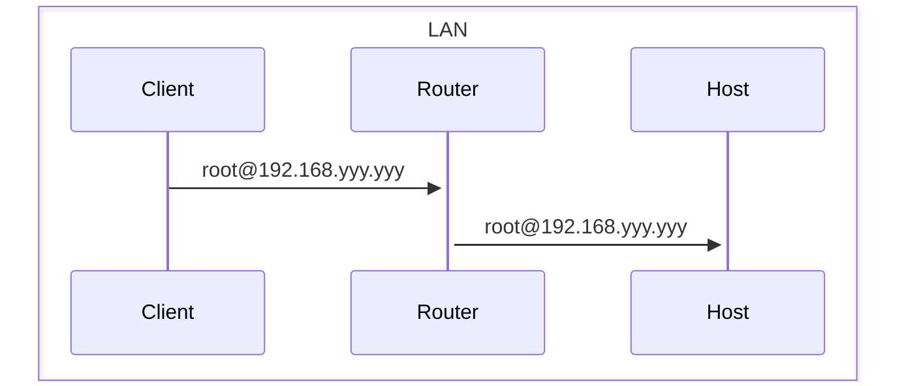
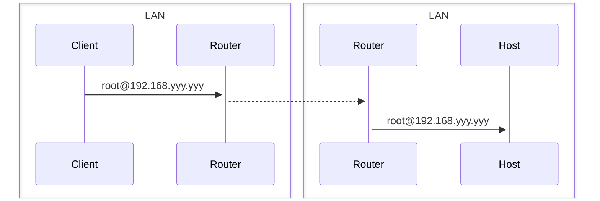
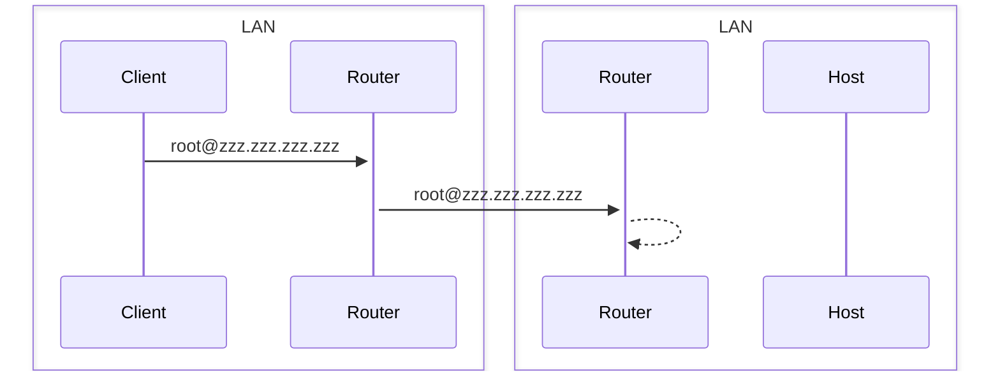
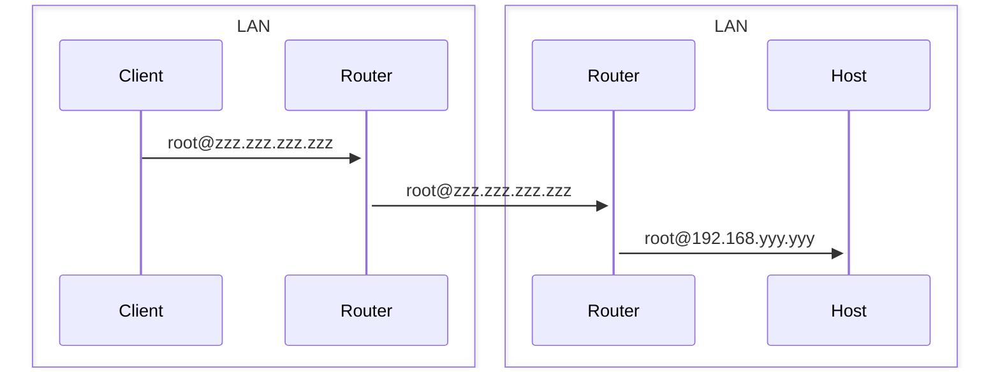
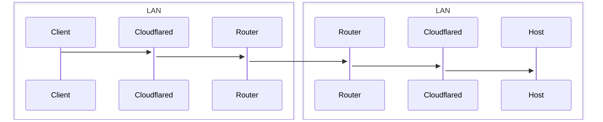

## SSH+Cloudflared

ホストとクライアントがどちらもローカルネットワークにあるのであればルータから割り当てられたローカルアドレス(192.168.xxx.xxx)を利用して簡単にアクセスできる。



このとき、何の問題もなく繋がるのはルーターが192.168.yyy.yyyがどこにあるかを知っているから、である。

### 外部から接続

では、クライアントが外部ネットワークにいる場合はどうなるだろう？



この場合はローカルネットワークを飛び越えてホストマシンを探さなければいけないので当然ローカルアドレスでは繋がらない。

つまり、ルーターのグローバルアドレスを知っておかなくてはならない。

ここでは仮にzzz.zzz.zzz.zzzが割り当てられていたとしよう。



すると無事にホストマシンが繋がっているルーターにまでは到達することができた。

しかし、ここで問題となるのはグローバルアドレスはルーター自体を指しているのであり、どのマシンに対してログインを試みているのかはわからないということだ。

> この場合であればルーター自身にSSHでログインをしようとしてしまっている

そこでルーター自身にSSH(ポート22)でアクセスがきたら192.168.yyy.yyyに通信を送ってください、というようにしなければならない。これが俗に言うポートフォワーディングである。



つまり、ポートフォワーディングをすることでzzz.zzz.zzz.zzzへのアクセスは192.168.yyy.yyyに変換されているような感じになっている。

### 問題点

なので、

- グローバルアドレス指定
- ルーターのポートフォワーディング

を設定することで、外部からSSH接続することは可能である。

じゃあこれで問題ないじゃないかという気もするのだが、いくつかの点で不都合が生じる。

一つ目は「グローバルアドレスは一般的に常に固定ではない」ということだ。

もしもルーターの再起動などでzzz.zzz.zzz.zzzの値が変わってしまえばSSH接続はできなくなる。

更に困ったことに、どの値に変わったかを外部から知ることはできない。

これを解消するにはDDNSという仕組みを利用する方法があるが、別途サーバーを起動している必要があったりしてめんどくさい。

具体的にはグローバルアドレスとドメイン名を定期的に紐つける仕組みをもったサーバーをホスト側のネットワークで動かしておくのだが、一行上にも書いたがこれはめんどくさい。

二つ目の問題点はローカルネットワーク内にSSHで繋ぎたいサーバーが複数ある場合、ポートフォワーディングの設定をするのがめんどくさいということだ。

ポートフォワーディングは単に指定されたポートの通信をネットワーク内の別のアドレスに流しているだけなので、一般的には同一のポートの通信を複数の別のアドレスに流すことはできない。

繋ぎたいホストが二つあった場合、一方はポート22、もう一方はポート2222でアクセスする、みたいな謎の配慮が必要になる。

マシンが二台ならまあこれでもいいかもしれないが、更に増えると余計にめんどくさい。

というか、ポートフォワーディングする仕組み自体がめんどくさい。

ポートフォワーディングをするということは外部のネットワークに対してグローバルアドレスで待ち受け可能になるということであり、さまざまな攻撃手法にさらされることになる。

SSHの接続設定を厳密にしておかないと大量のアクセスでログが埋まってしまうこともある。

## 解決方法

ここで登場するのが大いなる存在、Cloudflareである。

これは先程紹介した手法の、

- グローバルアドレスが変わる
- 複数のマシンがある場合にめんどくさい

という問題を一度に解決してくれる。



何も書いてなくて申し訳ないが、具体的には上のような感じでクライアントはローカルネットワークを飛び越えてホストに接続できる。

何故ローカルネットワークを超えられるのかというとホストマシンで動いているcloudflaredがホストマシンのグローバルアドレスを知っている、からである。

cloudflaredは定期的にホストマシンのグローバルアドレスを更新しており(多分)、現在サーバーがどうなっているかをCloudflareのウェブサイトから確認することができる。

ただし、注意点としてクライアント自身にもCloudflaredのサービスがインストールされている必要がある。

とはいえ、これはただインストールするだけなので大した問題にはならない。macOSならHomebrewが利用できるので以下のコマンドを叩くだけである。

```zsh
brew install cloudflared
```

WindowsやLinuxも当然サポートされている、導入方法については[こちら](https://developers.cloudflare.com/cloudflare-one/connections/connect-networks/downloads/)。

ホストマシンにもcloudflaredはインストールする必要があるが、めんどくさいのでDockerを利用する。

### ホストマシン

ホストマシンに必要なのは、

- openssh-server
- docker
- docker compose

の三つだけである。Ubuntu Serverなどであれば初回インストール時にこの三つはどれもインストールすることができる。

適当なディレクトリを用意して以下の`docker-compose.yaml`を書いて保存して`docker compose up -d`で実行する。

```yaml
version: '3.9'

services:
  cloudflare_tunnel:
    restart: always
    image: cloudflare/cloudflared
    command: tunnel run
    container_name: cloudflared_ssh
    environment:
      TUNNEL_TOKEN: $TUNNEL_TOKEN
    extra_hosts:
      - host.docker.internal:host-gateway
```

このファイルは環境変数`TUNNEL_TOKEN`を利用しているので同じディレクトリに`.env`を作成する。

```zsh
TUNNEL_TOKEN=...
```

`TUNNEL_TOKEN`の値については[Cloudflare Zero Trust](https://one.dash.cloudflare.com/)でNetworksからTunnelsを選択して適当なTunnel name(今回の場合であればsshなどが適切か)で新規作成してChoose your environmentでDockerを指定して取得すればよい。

よくわからんという人は[Cloudflare Tunnel を使って自宅をデータセンターみたいにする](https://zenn.dev/takajun/articles/fbd783e459c722)でトークンをとってきているところを参考にすれば良いと思う。

#### Public Hostname Page

ドメイン名は適当で良いのだがServiceの項目は少し注意が必要(ここでハマった)。

- Service
    - `SSH`
- URL
    - `host.docker.internal:22`

と書く。この設定については[Browser SSH connection using cloudflared docker image not working](https://community.cloudflare.com/t/browser-ssh-connection-using-cloudflared-docker-image-not-working/449037/5)が役に立ちました。

URLの部分を`localhost:22`と書くと繋がらなかった、なにか解決法があるかもしれないけれど。

### クライアント

cloudflaredを利用してSSH接続を行うように修正する。

```zsh
Host ssh.tkgstrator.work 
  User XXXXXX
  Port 22
  ProxyCommand /opt/homebrew/bin/cloudflared access ssh --hostname %h
```

自分の場合は上のように設定した。このProxyCommandがないとCloudflaredで待ち受けているSSHには繋がらないので注意。

繋いでみると以下のように表示される。ProxyCommandを利用した場合はホストのIPは表示されないようだ。

```zsh
The authenticity of host 'ssh.tkgstrator.work (<no hostip for proxy command>)' can't be established.
ED25519 key fingerprint is SHA256:fJjSEgZ5PB7tGtNTrWEctH4L4J3xvUagxFSfkDnTvMA.
This key is not known by any other names.
Are you sure you want to continue connecting (yes/no/[fingerprint])? yes
Warning: Permanently added 'ssh.tkgstrator.work' (ED25519) to the list of known hosts.
Welcome to Ubuntu 22.04.3 LTS (GNU/Linux 6.5.0-15-generic x86_64)

 * Documentation:  https://help.ubuntu.com
 * Management:     https://landscape.canonical.com
 * Support:        https://ubuntu.com/pro

  System information as of Mon Feb  5 01:09:54 AM UTC 2024

  System load:                      0.04345703125
  Usage of /:                       9.7% of 97.87GB
  Memory usage:                     5%
  Swap usage:                       0%
  Temperature:                      48.0 C
  Processes:                        190
  Users logged in:                  0
  IPv4 address for br-8e6287ec62ac: 172.20.0.1
  IPv4 address for br-acd59a71e520: 172.19.0.1
  IPv4 address for br-b7073bf52aec: 172.18.0.1
  IPv4 address for docker0:         172.17.0.1
```

記事は以上。